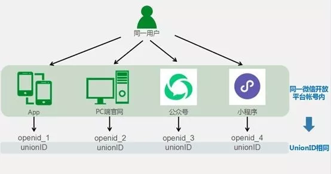

在 GrowingIO 的数据模型中，根据分析场景需要，建立了两套用户模型来：访问用户和登录用户。

举例来说：
小明在手机上刷朋友圈时看到了某个电商平台的 H5 广告页面，他点击了这个广告内容，进入了一个引导注册的 H5 页面，小明填写自己的手机号通过验证，注册成功，并在成功页面看到提示下载 App 即送 5 张满减优惠券，小明下载了 App 并登录，选择了自己心仪的产品后使用优惠券结算，完成了购买流程。
上述的例子是一个典型的互联网营销的案例，我们通过上述案例来描述一下 GrowingIO 的两种用户模型分别适合在哪些分析场景下使用。

## 访问用户
访问用户是 GrowingIO 对访问您应用（包括网页、App、微信小程序等，下同）的用户的一种识别机制模型。

每一个访问您应用的用户 SDK 都会生成一个唯一 ID(32位字符串) 并存储在对应的设备中，我们称之为**访问用户ID**。

**访问用户ID**：GrowingIO SDK 为所有终端应用生成的唯一 ID，用于标识访问用户，如果您想要分析的是产品所有访客，可以选择“访问用户”。上面的例子中，小明访问 H5 广告页面时，GrowingIO SDK 会在浏览器中的生成一个唯一 ID 并记录在浏览器的 Cookie 中，这个 ID 将作为小明今后在该 H5 站点的唯一 ID。

对于不同平台类型的应用，GrowingIO SDK 提供了不同的访问用户ID生成方案，从而尽可能的实现对用户的唯一标识。同一个项目(平台项目ID)中相同的访问用户ID会被识别为一个用户。

### iOS
IDFA > IDFV > 随机访问用户ID<br/>
iOS设备如果想要使用IDFA作为访问用户ID，需要请求用户授权允许开启广告跟踪，获取IDFA之后初始化SDK；如果拒绝授权，iOS 按照优先级 IDFV > 随机访问用户ID, 生成访问用户ID ；使用Keychain存储，删掉应用后再次安装还是同一访问用户ID。

:::tip 说明
```c
// 部分代码段
NSString *deviceId;
NSUUID *uuid = ((NSUUID * (*)(id, SEL))[sharedManager methodForSelector:advertisingIdentifierSelector])(
        sharedManager, advertisingIdentifierSelector);
deviceId = [uuid UUIDString];

deviceId = [[[UIDevice currentDevice] identifierForVendor] UUIDString];

deviceId = [[NSUUID UUID] UUIDString];
```
* IDFA： 是一串16进制的32位字符串。全称是Identifier For Advertising。[Apple Developer Documentation](https://developer.apple.com/documentation/adsupport/asidentifiermanager/1614151-advertisingidentifier/)<br/>
  APP 用户允许广告跟踪后，SDK 通过调用 Apple API 获取，一台设备上，不同 APP 获取到的 IDFA 相同，用户在设备设置中点击还原广告标识符后会发生变化。<br/>
  设计目的是，标识用户设备，用于提供给各个APP之间跟踪广告所用。
  
* IDFV: 是一串16进制的32位字符串。全称是Identifier For Vendor。[ Apple Developer Documentation](https://developer.apple.com/documentation/uikit/uidevice/1620059-identifierforvendor)<br/>
  无需 APP 用户授权，SDK 可通过调用 Apple API 直接获取，一台设备上，同一个 APP 提供商(Vendor) 的所有 APP 中获取到的IDFV 相同，这个提供商的所有 APP 都被删除后，下次安装，获取到的 IDFV 会发生变化。<br/>
  IDFV，一般可以用于同一个厂家不同APP之间的交叉推广活动。
* Keychain: 是一种 Apple 的安全存储敏感信息⼯具。即使删除 APP，再次安装，也可以获取删除之前 Keychain 中存储的数据

详情参考内部文档【[访问用户ID生成逻辑](https://growingio.atlassian.net/wiki/spaces/SDK/pages/2652209369/id)】
:::

### Android
androidId > imei > 随机访问用户ID<br/>
Android 设备首先会获取AndroidID，如果AndroidID 为空或为“9774d56d682e549c”(山寨机或其他设备)，会请求用户授权获取IMEI，如果IMEI获取不到，会随机访问用户ID ；使用本地文件存储，删掉应用后再次按照逻辑生成可能会不一样。

:::tip 说明
```java
// 部分代码段
String deviceId = null;

String adId = getAndroidId();
deviceId = UUID.nameUUIDFromBytes(adId.getBytes(Charset.forName("UTF-8"))).toString();
        
String imi = getImei();
deviceId = UUID.nameUUIDFromBytes(imi.getBytes(Charset.forName("UTF-8"))).toString();

deviceId = UUID.randomUUID().toString();
```
* AndroidID: SSAID，是 Android 设备里不依赖于硬件的一种「半永久标识符」，Android 8.0 之后，在相同设备上运行的签名不同的应用获取到的 AndroidId 不同。<br/>
  但同一个开发者可以根据自己的数字签名，将所开发的不同 App 进行关联。<br/>
* IMEI: 国际移动设备识别码（International Mobile Equipment Identity, IMEI)，作为运营商识别入网设备信息的标识。<br/> 
  是一种不可重置的永久标识符，一台设备的IMEI永不会变。<br/>
  Android 10 之后，非厂商应用无法获取 IMEI。
* 本地文件存储：Android 的一种数据存储方式。应用删除后本地文件存储数据也会被删除
  
详情参考内部文档【[访问用户ID生成逻辑](https://growingio.atlassian.net/wiki/spaces/SDK/pages/2652209369/id)】
:::
### 小程序
OpenID或UnionID  > 随机访问用户ID<br/>
如果 SDK 设置开启强制登录模式，用户授权微信登录获取到OpenID或UnionID且调用 identify 传入，会使用传入的ID 作为访问用户ID ，否则会使用 SDK 自动生成随机访问用户ID作为访问用户ID。使用 Storage 存储，删除小程序再次进入访问用户ID 会改变（访问用户ID是 OpenID或UnionID 的情况不会）。

:::tip 说明
* OpenId：用户唯一标识。同一用户在在不同小程序中 OpenId 相同，不受清除小程序缓存影响。
* UnionID：用户在微信开放平台帐号下的唯一标识。若当前小程序已绑定到微信开放平台帐号，会生成 UnionID，同一用户在同一个微信开放平台账号下，不同应用的 UnoinID 相同
* Storage 存储：一种小程序数据缓存机制。只有在代码包被清理的时候Storage才会被清理，如用户主动删除或因存储空间原因被系统清理。

关于获取 OpendID、UnoinID 请参考 [`wx.login`](https://developers.weixin.qq.com/miniprogram/dev/api/open-api/login/wx.login.html)。调用 `wx.login` 无需用户授权，参考[公告](https://developers.weixin.qq.com/community/develop/doc/00022c683e8a80b29bed2142b56c01?highLine=wx.login)


:::
### Web
随机访问用户ID<br/>
Web使用随机访问用户ID作为访问用户ID，  使用 localStorage 存储，永久有效，删除后再次生成会改变。

:::tip 说明
localStorage：浏览器的一种数据存储机制。 存储数据永久有效，用户可浏览器中清空对应网站下的 localStorage 数据，再次访问该网站会生成一个新访问用户ID。
:::

## 登录用户
登录用户是 GrowingIO 绑定业务系统的登录用户的一种识别机制模型。<br/>
同时支持登录用户的不同身份体系，例如在小程序端登录用户ID是手机号，在APP端登录用户ID是邮箱账号，userKey用于标记不同的身份体系。

### 登录用户ID
也就是注册用户ID，用于标记登录用户。当用户访问应用并发生注册/登录行为时，可以通过GrowingIO SDK 中的 API 将该用户的注册 ID（或与之对应的唯一标识，可以加密处理）进行上报。

在上面的例子中，如果将小明的注册ID 在小明发生 H5 注册时和 App 登录时通过 API 上报，这个 ID 会被作为今后小明在各个地方使用您的产品的身份识别ID。GrowingIO 分析系统将可以通过登录用户ID 将小明在多个平台上的行为归结为同一个人。

## 用户属性
为了能够按照某一个用户的属性或者特征来分拆分析用户行为，GrowingIO 提供了用户属性的概念，允许研发通过调用 SDK 的 API 上传用户相关的属性，并支持在分析工具中使用用户属性来进行更加贴近业务的分析。

