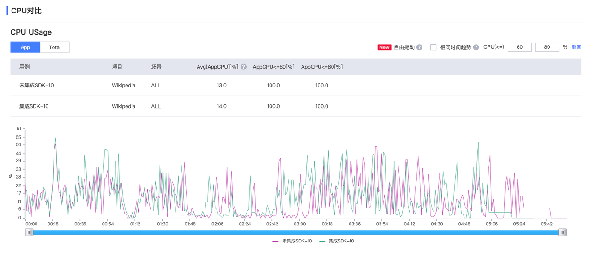
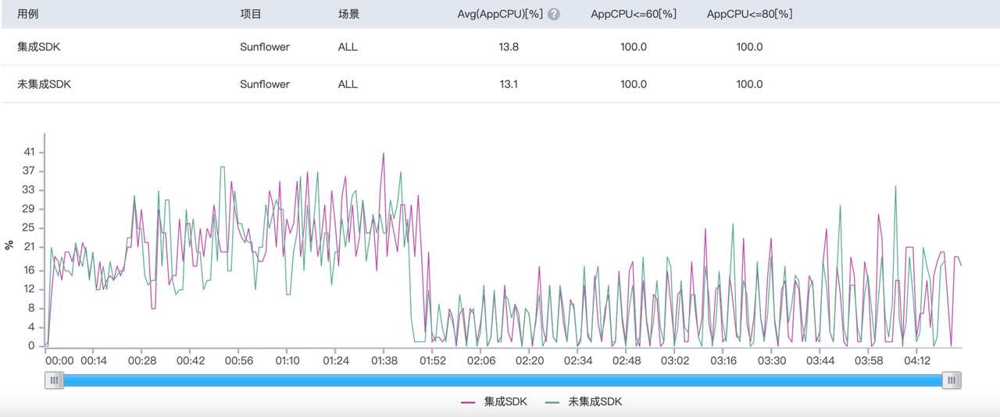
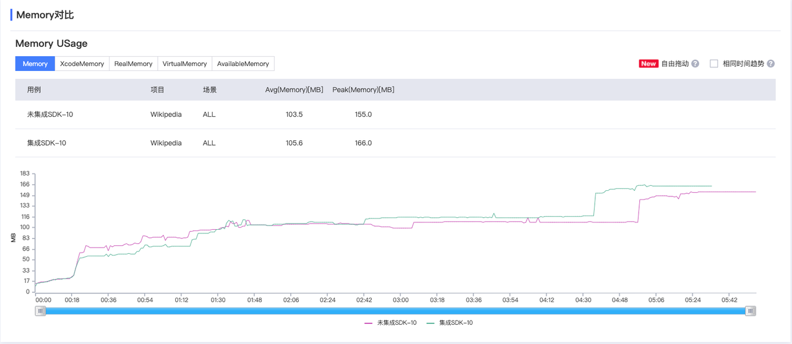
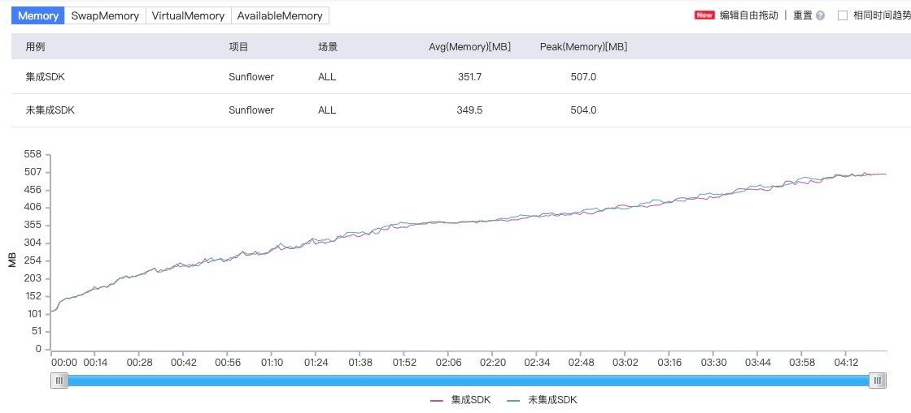

:::tip 提示
支持性能说明文档下载：[APP SDK性能说明PDF](../../../static/pdf/APP%20SDK%20%E6%80%A7%E8%83%BD%E8%AF%B4%E6%98%8E.pdf)
:::
## 1.测试概述
### 1.1 测试目的
本次测试从CPU、内存、冷启动耗时等维度，综合检测SDK性能指标。
### 1.2 指标和术语
CPU 使用率，内存占用量 ，冷启动耗时 
### 2.设备和工具
#### 设备

| Android | iOS | SDK 版本 |
|:----:|:---:|:---|
| 华为 Nexus 6P- Android 7 | iPhone 6s -  iOS14.0 | 3.2.0 |

#### 工具

| 工具 | 作用 |
|:----:|:---:|
| DoraemonKit | 统计冷启动耗时 |
| PerfDog | 统计 CPU， 内存 |
| cloc，Statistic | 统计代码行数 |

## 3.测试方案
### 启动耗时
使用DoraemonKit 打点记录时间，检测集成/未集成 SDK 的 App，差异化分析后统计

### CPU 使用率
使用 PerfDog 检测集成/未集成 SDK 的自动化 UI 测试的 App，差异化分析后统计

### 内存占用量
使用 PerfDog 检测集成/未集成 SDK 的自动化 UI 测试的 App，差异化分析后统计

### 包体积增量
使用新建 Demo 集成对应平台 SDK，并对比集成前后 App 体积，统计体积增量

## 4. 测试结果
### 4.1 CPU
#### iOS
- 测试机型为 iPhone 6s，集成版本为 SDK 3.2.0
- 为减少检测环境对检测结果的影响，取多次检测后的平均值
经多次检测后对比，CPU 平均使用率的测试结果平均值由 13.2% 增加到 13.6%


#### Android
- 测试机型为 华为 Nexus 6P，低端机更有利于体现 CPU 使用率的波动
应用的 CPU 由 13.1% 增加到 13.8%


#### 结论
经过比对集成 SDK 和未集成 SDK 在高频使用下可知，CPU 使用率基本没有较大差别。


### 4.2 内存
#### iOS
- 测试机型为 iPhone 6s，集成版本为 SDK 3.2.0
- 为减少检测环境对检测结果的影响，取多次检测后的平均值
经多次检测后对比，平均内存占用量的测试结果平均值由 94.7 MB 增加到 97.3 MB，峰值内存占用量的测试结果平均值由 149.9 MB 增加到 156.4 MB，符合对外指标


#### Android
- 测试机型为 华为 Nexus 6P
- 为减少检测环境对检测结果的影响，取多次检测后的平均值
经多次检测后对比，平均内存占用量的测试结果平均值由 349 MB 增加到 351 MB，峰值内存占用量的测试结果平均值由 504 MB 增加到 507 MB


#### 结论
经检测无内存泄漏，内存占用均值在 10 MB 以内。

### 4.3 冷启动耗时

| SDK 3.0 | DoraemonKit -> 启动耗时（单位：ms）|
| :---: | :----- |
| iOS | 4.8 - 6.2 |
| Android | 15 - 17 |

#### iOS DoraemonKit SDK 初始化耗时检测
```txt
 1|   5.24|   +[GrowingAutotracker startWithConfiguration:launchOptions:]
 2|   5.21|     +[GrowingRealAutotracker trackerWithConfiguration:launchOptions:]
 3|   5.21|       -[GrowingRealAutotracker initWithConfiguration:launchOptions:]
 4|   1.50|         -[GrowingRealAutotracker addAutoTrackSwizzles]
 4|   1.98|         +[GrowingSession startSession]
 5|   1.96|           -[GrowingSession initWithSessionInterval:]
 6|   1.94|             -[GrowingPersistenceDataProvider loginUserId]
 7|   1.90|               -[NSUserDefaults valueForKey:]
```

#### Android DoraemonKit SDK 初始化耗时检测
```txt
2021-07-22 10:48:14.909 13702-13702/com.example.myapplication100 I/DOKIT_SLOW_METHOD: =========DoKit函数调用栈==========
    level    time    function
    // Application OnCreate 函数总耗时
    0********89ms********com.example.myapplication.CustomApplication&onCreate
    // Doraemonkit 初始化函数耗时
    1********56ms*************com.didichuxing.doraemonkit.DoKit$Builder&build
    2********55ms*****************com.didichuxing.doraemonkit.DoKitReal&install
    3********2ms*********************com.didichuxing.doraemonkit.DoKitReal&initThirdLibraryInfo
    3********4ms*********************com.didichuxing.doraemonkit.DoKitReal&initAndroidUtil
    3********3ms*********************com.didichuxing.doraemonkit.DoKitReal&registerNetworkStatusChangedListener
    3********2ms*********************kotlinx.coroutines.BuildersKt&launch$default
    4********2ms*************************kotlinx.coroutines.BuildersKt__Builders_commonKt&launch$default
    5********2ms*****************************kotlinx.coroutines.BuildersKt&launch
    // 以下为 SDK 初始化函数耗时
    1********17ms*************com.growingio.android.sdk.autotrack.GrowingAutotracker&startWithConfiguration
```


### 4.4 包体积增量
#### 代码行数检测工具
- iOS代码行数使用 cloc 工具，仅统计 code，不含空行与注释
- Android 代码行数使用 Statistic 插件进行统计，主要统计 Java 代码以及 Koltin 代码行数
#### 检测数据
以下App体积大小为 Finder → 显示简介获取到的安装包大小
#### iOS
> Demo 工程编译后 App 体积原大小 119 KB (119,229 Bytes)，仅 ARM 64

| SDK | 集成方式 | App 体积大小 | 体积增量 | SDK 代码行数 |
| :---: | :--- | :-----:  | :---: | :-----: |
| SDK 2.0 SaaS 埋点 | pod 'GrowingCoreKit', '2.9.3' | 2.3 MB (2,334,397 Bytes) | 2.2 MB (2,215,168 Bytes) | 28,764 |
| SDK 2.0 SaaS 无埋点 | pod 'GrowingAutoTrackKit', '2.9.3' | 3.8 MB (3,770,301 Bytes) | 3.7 MB (3,651,072 Bytes) | 47,407 (18,643 + 28,764) |
| SDK 3.0 无埋点 | pod 'GrowingAnalytics', '3.2.0' | 1.7 MB (1,674,389 Bytes) | 1.6 MB (1,555,160 Bytes) | 16,757 |
| SDK 3.0 CDP | pod 'GrowingAnalytics-cdp/Autotracker', '3.2.0' | 1.8 MB (1,816,245 Bytes) | 1.7 MB (1,697,016 Bytes) | 16,972 (215 + 16,757) |
| SDK 3.0 CDP（从 2.0 升级）| pod 'GrowingAnalytics-cdp/Autotracker', '3.2.0'<br/>pod 'GrowingAnalytics-upgrade/Autotracker-upgrade-2to3-cdp', '1.1.1' |  2.4 MB (2,435,069 Bytes) | 2.3 MB (2,315,840 Bytes) | 24,169 (7,197 + 215 + 16,757) |

#### Android
> Demo 工程编译后 APK 体积原大小 2.9 MB (2,866,411 Bytes)

| SDK | 集成方式 | App 体积大小 | 体积增量 | SDK 代码行数 |
| :---: | :--- | :-----:  | :---: | :-----: |
|SDK 2.0 SaaS 埋点 | implementation 'com.growingio.android:vds-android-agent:track-2.9.3' | 3.1 MB (3,074,690 Bytes) | 0.2 MB (208,279 Bytes) | 22,328 |
| SDK 2.0 SaaS 无埋点 | implementation 'com.growingio.android:vds-android-agent:autotrack-2.9.3'classpath 'com.growingio.android:vds-gradle-plugin:autotrack-2.9.3' | 3.1 MB (3,142,131 Bytes) | 0.3 MB (275,720 Bytes) | 52,999 (30,671 + 22,328) |
| SDK 3.0 无埋点 | implementation 'com.growingio.android:autotracker:3.2.0'classpath 'com.growingio.android:autotracker-gradle-plugin:3.2.0' | 3.2 MB (3,188,374 Bytes) | 0.3 MB (321,963 Bytes) | 31,912 |
| SDK 3.0 CDP |	implementation 'com.growingio.android:autotracker-cdp:3.1.0'classpath 'com.growingio.android:autotracker-gradle-plugin:3.1.0' |	3.2 MB (3,189,509 Bytes) | 0.3 MB (323,098 Bytes) | 33,457（31,921 + 1,545） 注：android SDK 3.0 无埋点与CDP 在版本号3.2.0之后统一为无埋点版本，CDP版本最后的版本为3.1.0 |
| SDK 3.0 CDP（从 2.0 升级）| implementation 'com.growingio.android:autotracker-cdp:3.2.0'implementation 'com.growingio.android.sdk.upgrade:autotracker-upgrade-2to3-cdp:1.0.0'classpath 'com.growingio.android:autotracker-gradle-plugin:3.2.0'	| 3.2 MB (3,191,344 Bytes)	| 0.3 MB (324,933 Bytes) | 32,340 (31,912 + 428) |


#### 结论
##### iOS
SDK 3.0 (CDP) 体积增量为 1.7 MB，SDK 2.0 (SaaS 无埋点) 体积增量为 3.7 MB，SDK 2.0 (SaaS 埋点) 体积增量为 2.2 MB
##### Android
SDK 3.0 (CDP) 体积增量为 0.3 MB，SDK 2.0 (SaaS 无埋点) 体积增量为 0.3 MB，SDK 2.0 (SaaS 埋点) 体积增量为 0.2 MB

## 5. 总结
经过对 SDK 的多次测试和数据报表分析，可以得出如下结论：
1. CPU 使用率保持在 5% 以下 ，对CPU使用无明显影响。
2. 无内存泄漏，内存占用均值在 10 MB 以内，对内存占用无明显影响。
3. 冷启动耗时占用较少， 对app冷启动无明显影响。