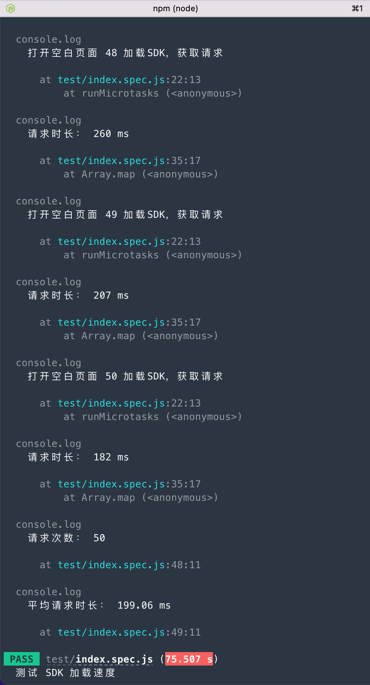
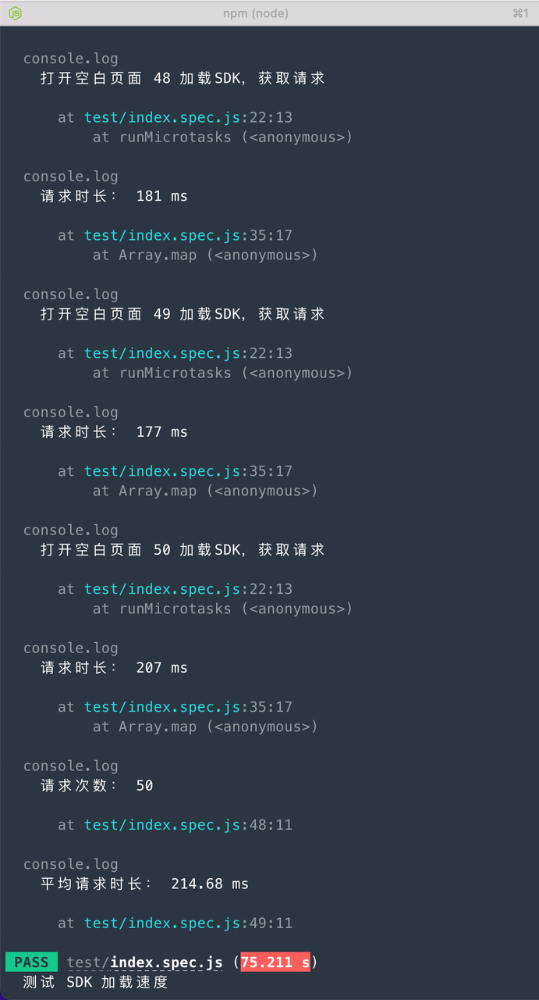
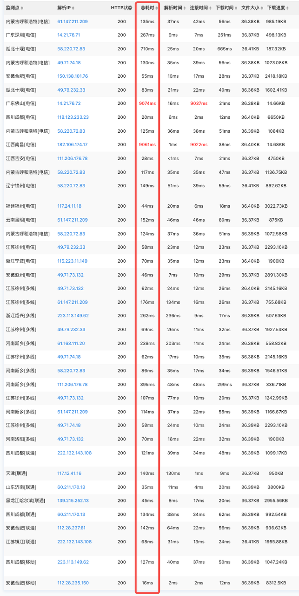

:::tip 提示
支持性能说明下载：[Web JS SDK性能说明PDF](../../../static/pdf/Web%20JS%20SDK%20性能说明.pdf)
:::

## Web JS SDK加载
GrowingIO发布的Web JS SDK在CDN上，CDN服务商在各地部署有服务器，用户请求资源时就近获取所需内容，降低网络拥塞，提高用户访问响应速度和命中率。 
因此，用户在加载网站请求Web JS SDK资源时，取决于CDN服务的响应速度和用户自身所在的网络环境。如果出现浏览网站时加载卡顿，响应时间过长，在排除CDN服务商的因素后排查自身网络。
## Web JS SDK运行
Web JS SDK运行在浏览器中，会占用部分内存进行监听及数据处理。需要使用到Cookie进行存放少量的用户Id等信息，存取率极低。SDK上线时我们会经过多轮不同场景的测试，保证客户在使用过程中不会有运行问题出现。
## Web JS SDK上报数据
Web JS SDK上报方式主要有3种，分别为 sendBeacon、XMLHttpRequest、图片请求。 
sendBeacon介绍请见https://developer.mozilla.org/zh-CN/docs/Web/API/Beacon_API 。不阻塞请求，不会对网站的业务请求有影响。除IE浏览器之外的其他主流浏览器均支持。 
XMLHttpRequest是为不支持sendBeacon的浏览器和sendBeacon上报失败的降级使用方式。是IE浏览器的主要上报方式。
图片请求是对XMLHttpRequest请求失败时最后兜底的上报方案。尽最大可能地保证上报数据不会丢失。 
上报数据服务端收到即可，所有的上报接口均没有返回值，状态码为200或204。 
上报时机：由于Web端产生的数据不会进行存储，因此我们会实时发送（即事件产生即上报）。 
上报频率：取决于页面事件触发频率。
## CDN平均时延测试
我们通过模拟用户使用场景专门对SDK的CDN加载进行了测试。
### 测试环境：

### 测试项目描述：
1、新建一个没有任何节点（即Body为空）的Html文件，在Head中仅引入Web SDK CDN地址（即） 
以上是为了排除其他资源和Dom加载的影响，在加载网页时仅有html和SDK的js两个请求，以便准确获取SDK加载时间。 
2、新建本地Node服务。 
3、新建Jest测试用例。使用puppeteer进行浏览器可视化测试。大致测试逻辑如下（单次）： 
1）puppeteer创建浏览器实例（打开Chromium） 
2）获取页面实例，添加请求监听（监听一个请求发起和结束）。在监听中判断script类型的请求，发起请求时获取当前时间戳，结束请求时获取当前时间戳并与开始时间相减获得该请求从开始到返回的时长（即SDK加载总时长）。由于是监听方式，会存在与浏览器之间的细微误差，但误差值小于10ms。 
3）获得SDK加载总时长后打印日志存入数组并关闭浏览器。 
4）重复上述测试过程50次，并对数据进行求平均值。 
4、由于命令行无法显示过多日志结果，因此需进行多次手动启动，获取到用例中的平均值后再取平均值。重复操作10次，因此请求测试次数即为500次。 
测试结果： 
经过GrowingIO单轮50次，重复10轮，即共500次的测试结果，在请求CDN上的SDK加载的时延平均约为 202ms 。 
测试结果仅供参考，结果受网络环境条件影响大。 
附部分截图： 

## SDK 加载慢问题排查
## 如何排查是否为CDN服务的问题
使用全国网络测试的工具类网站进行检测。 
参考地址：https://tool.chinaz.com/speedtest/https://assets.giocdn.com/2.1/gio.js
CDN资源时延受地域影响较大。一般可能会有部分节点存在无响应或延迟高的问题，但不影响资源的正常加载。因为CDN服务有负载均衡及时延算法，在加载资源时除了优先就近，还会考虑时延，从而提供最优地址进行资源下发。 
附：全国2022年3月17日 18:00瞬时时延。 

### 如何排查是否为自身网络问题
使用代理软件、网络带宽低、计算机内存过小、计算机中毒等等。 
排查方式一般为更换网络环境、更换设备重试对比排查等。 
### 如何降低CDN时延对资源加载的影响
可尝试将SDK文件下载至本地项目中，部署在业务服务器上，可以有效降低CDN服务可能的不稳定导致的时延过长问题。
